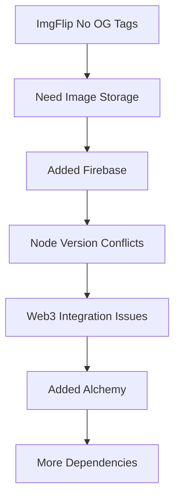

# SolanaRoast.lol - Path Forward Analysis

## Current Status Review
We successfully completed through Phase 3.1 with a working application that:
- ✅ Connects to Solana wallets
- ✅ Generates AI roasts
- ✅ Creates memes
- ✅ Has a working Windows 95 UI
- ✅ Simple and effective sharing implementation

## Root Cause Analysis

### 1. Where We Deviated
```typescript
// Simplified approach we implemented
const shareMeme = {
  twitter: (text: string, url: string) => {
    return `https://twitter.com/intent/tweet?text=${text}&url=${url}`;
  },
  native: async (text: string, url: string) => {
    return navigator.share({ text, url });
  },
  download: (memeUrl: string) => {
    // Direct meme download
  }
};
```

### 2. Dependency Chain


## Recommended Path Forward

### Option 1: Revert to Last Stable Version (Recommended)

1. **Core Features**
```typescript
interface CoreFeatures {
  connectWallet(): Promise<string>;
  generateRoast(address: string): Promise<RoastResponse>;
  generateMeme(roast: RoastResponse): Promise<string>;
}

// Simple sharing implementation
interface SharingFeatures {
  downloadMeme(memeUrl: string): void;
  copyToClipboard(text: string): void;
  shareToTwitter(text: string): void;
}
```

2. **Simplified Architecture**
```typescript
// Simple caching solution
const memeCache = new NodeCache({ stdTTL: 3600 });

const getMeme = async (roastId: string) => {
  const cached = memeCache.get(roastId);
  if (cached) return cached;
  
  const meme = await generateMeme(roastId);
  memeCache.set(roastId, meme);
  return meme;
};
```

### Option 2: Fresh Start (Alternative)

If choosing to restart, key principles:
1. **Core First**
   - Get basic roasting working
   - Simple meme generation
   - Basic sharing

2. **Feature Flags**
```typescript
const FEATURES = {
  SOCIAL_SHARING: false,
  MEME_GENERATION: true,
  WALLET_HISTORY: false
} as const;

const ShareButton = () => {
  if (!FEATURES.SOCIAL_SHARING) {
    return <DownloadButton />;
  }
  return <SocialShareButton />;
};
```

3. **Modular Architecture**
```typescript
// Core module - always loaded
const CoreModule = {
  roastGeneration: RoastService,
  walletConnection: WalletService,
  memeGeneration: MemeService
};

// Optional modules - lazy loaded
const SocialModule = lazy(() => import('./social'));
const AnalyticsModule = lazy(() => import('./analytics'));
```

## Implementation Plan

### Phase 1: Core Restoration
1. Identify last stable commit
2. Remove Firebase dependencies
3. Implement simple sharing
4. Test core features

### Phase 2: Enhancement
1. Add download functionality
2. Implement basic Twitter sharing
3. Add copy-to-clipboard
4. Simple analytics (optional)

### Phase 3: Future Features
1. Consider simpler alternatives for social previews
2. Implement progressive enhancement
3. Add optional features with flags

## Decision Points
1. Keep current codebase or fresh start?
2. Which features are truly core?
3. How to handle social sharing simply?
4. Development timeline priorities? 