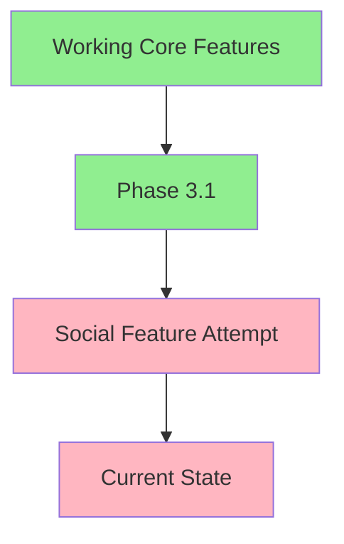

 # SolanaRoast.lol - Final Recommendation

## Executive Summary
After analyzing both approaches and our current situation, I recommend a **Hybrid Approach with Immediate Stabilization**, combining the best elements of both recommendations.

## Current State Assessment


### Working Features (✅)
- Wallet Connection
- AI Roast Generation
- Meme Creation
- Windows 95 UI
- Basic Sharing

### Problem Areas (⚠️)
- Social Preview Integration
- Dependency Conflicts
- Complex Error Handling
- Testing Complexity

## Immediate Action Plan

### 1. Stabilization Phase
```typescript
// 1. Remove problematic dependencies
const removeDependencies = [
  'firebase',
  'firebase-admin',
  'alchemy-sdk'
];

// 2. Revert to simple RPC
const simpleSolanaSetup = {
  rpcUrl: process.env.SOLANA_RPC_URL,
  commitment: 'confirmed'
};

// 3. Implement simple sharing
const simpleSharingSystem = {
  downloadMeme: async (memeUrl: string) => {
    const response = await fetch(memeUrl);
    return new Blob([await response.arrayBuffer()]);
  },
  shareToTwitter: (text: string) => {
    return `https://twitter.com/intent/tweet?text=${encodeURIComponent(text)}`;
  }
};
```

### 2. Core Feature Enhancement
```typescript
interface CoreSystem {
  // Essential features only
  wallet: {
    connect(): Promise<string>;
    disconnect(): void;
    getBalance(): Promise<number>;
  };
  
  roast: {
    generate(address: string): Promise<RoastResponse>;
    getMeme(roast: RoastResponse): Promise<string>;
  };
  
  share: {
    download(memeUrl: string): void;
    copyToClipboard(text: string): void;
    shareToTwitter(text: string): void;
  };
}
```

### 3. Simple Caching Implementation
```typescript
class SimpleCache {
  private cache = new Map<string, {
    data: any;
    timestamp: number;
  }>();
  
  get(key: string): any | null {
    const entry = this.cache.get(key);
    if (!entry) return null;
    if (Date.now() - entry.timestamp > 3600000) {
      this.cache.delete(key);
      return null;
    }
    return entry.data;
  }
  
  set(key: string, data: any): void {
    this.cache.set(key, {
      data,
      timestamp: Date.now()
    });
  }
}
```

## Development Timeline

### Week 1: Stabilization
- [ ] Identify last stable commit
- [ ] Remove problematic dependencies
- [ ] Implement simple sharing
- [ ] Test core features

### Week 2: Enhancement
- [ ] Add download functionality
- [ ] Basic Twitter sharing
- [ ] Copy-to-clipboard
- [ ] Simple analytics

### Week 3: Polish
- [ ] UI improvements
- [ ] Error handling
- [ ] Performance optimization
- [ ] Documentation

## Future Considerations

### 1. Feature Flags System
```typescript
const FEATURES = {
  CORE: {
    WALLET: true,
    ROAST: true,
    MEME: true
  },
  SOCIAL: {
    TWITTER: process.env.ENABLE_TWITTER === 'true',
    DISCORD: process.env.ENABLE_DISCORD === 'true'
  },
  ANALYTICS: process.env.ENABLE_ANALYTICS === 'true'
} as const;
```

### 2. Progressive Enhancement
1. Basic functionality first
2. Enhanced sharing options
3. Analytics (if needed)
4. Community features (future)

## Key Decisions

1. **Keep Core Simple**
   - Focus on roasting functionality
   - Basic meme generation
   - Simple sharing mechanisms

2. **Avoid Over-engineering**
   - No complex storage solutions
   - Simple caching
   - Direct downloads

3. **Maintain Windows 95 Theme**
   - Unique selling point
   - Good user feedback
   - Viral potential

## Success Metrics
1. Core functionality reliability
2. User engagement
3. Sharing activity
4. Load times
5. Error rates

## Risk Mitigation
1. Regular dependency audits
2. Feature flag system
3. Simple fallback mechanisms
4. Clear error messages 